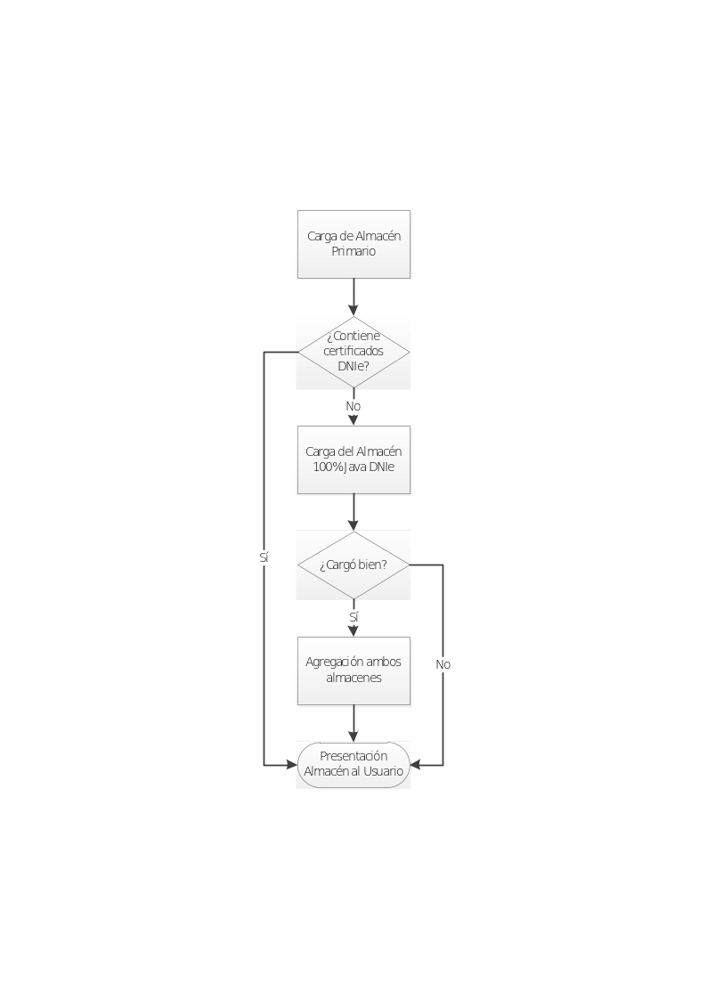

## Versión 2.1

### Cambios en el establecimiento de política de firma

La mejora en el establecimiento de política de firma propuesta para la
versión 2.1 consistiría en la solicitud, vía diálogo de configuración
(opciones) de los distintos campos que pueden figurar en una política
AdES (identificador, huella digital del identificador, algoritmo
utilizado para la huella y calificador al menos). La política por
defecto se guardará junto al resto de opciones de usuario. Además, el
usuario podrá seleccionar una política preconfigurada (AGE o FacturaE)
de modo que no tenga que teclear manualmente los valores.

### Multifirmas de firmas implícitas

La mejora en la funcionalidad para las multifirmas de firmas implícitas
consiste en:

-   Dar la posibilidad al usuario de, cuando se va a realizar una
    cofirma o contrafirma, extraer y visualizar los datos originalmente
    firmados.

-   Cofirmar una firma sin necesidad de seleccionar los datos
    originalmente firmados cuando estos ya estuviesen incluidos dentro
    de la propia firma.

### Mejora de experiencia de usuario

La mejora de experiencia de usuario propuesta para la versión 2.1
consistiría principalmente en una revisión de como se gestionan en el
interfaz gráfico las tareas de proceso de la aplicación, introduciendo
hilos de ejecución para pasar a segundo plano ciertos procesos, usar
diálogos de espera e introducir cursores de espera (reloj de arena).

También se automatizarán o agilizarán algunas tareas como, por ejemplo,
la asignación de extensiones por defecto a los ficheros descifrados.

### Mejora de la documentación

Se agregará a la documentación del proyecto información adicional de
utilidad para el usuario final. Esta mejora incluye:

-   Proceso de instalación del controlador del DNIe mediante el
    instalador accesible de Inteco,

-   Proceso de instalación del OpenDNIe.

### Soporte para la validación de firmas explícitas

Se ampliará la funcionalidad del validador de la interfaz para el
soporte de firmas explícitas. Cuando se detecte una firma sin contenido
implícito, se pedirá al usuario que seleccione el fichero de datos en
base al que se generó la firma para poder validarla al completo.

Cuando el usuario selecciona el fichero se validará con respecto a estos
datos y se mostrará el resultado de la validación. Si el usuario no
selecciona el diálogo, se validará el resto de la estructura y, en caso
de ser correcta, se mostrará una advertencia indicando que no se ha
podido completar la validación debido a que faltan los datos firmados.

### Decodificación de datos base 64 extraídos de firmas implícitas

Existen aplicaciones de firma que codifican los datos a base 64 para
firmarlos sin declarar la transformación, con lo cual firman la versión
codificada de estos datos en lugar de los datos originales. Aunque el
comportamiento por defecto sería extraer estos datos tal como se
firmaron, esto plantearía un problema para el usuario final que desea
recuperar los datos originales.

Se agregará a la aplicación la lógica necesaria para que se detecte si
los datos firmados son base 64 y, en esos casos, se descodifiquen al
extraerlos de la firma.

## Versión 2.2

### Soporte de factura electrónica

El soporte de factura electrónica (Factura-e) planificado para la
versión 2.2 consiste en la introducción de un nuevo formato de firma
específico para facturas electrónicas.

Al seleccionar este formato se comprobará que los datos se ajustan a la
estructura básica de una factura electrónica y se preguntará al usuario
qué política de firma se desea utilizar para firmarla (por defecto, la
versión 3.1 de la política).

### Incorporación soporte DNIe 100% Java

Esta tarea consiste en la integración en la herramienta de un
controlador Java para DNIe. El soporte de este dispositivo se reflejará
en la aparición de un nuevo almacén de certificados, con la nomenclatura
“DNIe”, disponible tanto desde la vista simple como avanzada de la
interfaz de escritorio. Los usuarios podrán seleccionar este almacén de
certificados para que se invoque a este controlador.

El uso de este controlador permitirá listar únicamente los certificados
del DNIe y utilizarlos sin necesidad de que se haya instalado el
controlador del DNIe en el sistema del usuario.

### Mejora del sistema de notificación de errores

Se estructurará el mecanismo de notificación de errores para ofrecer al
usuario mensajes más concretos que le ayuden a entender el motivo de
cualquier error que pueda haberse producido durante la ejecución de
cualquier operación criptográfica: Firma electrónica, configuración de
parámetros de firma, acceso a un almacén de certificados, cifrado
simétrico…

# Evolución de la aplicación de escritorio “Firma Fácil con @firma”

## Versión 1.1

### Incorporación soporte DNIe 100% Java

Esta tarea consiste en la integración en la herramienta de un
controlador Java para DNIe. Este controlador se utilizará por defecto
para el acceso al DNIe del usuario. En caso de no estar insertado este
en un lector de tarjetas configurado, se cargará el almacén de claves
por defecto del sistema.

El uso de este controlador permitirá listar únicamente los certificados
del DNIe y utilizarlos sin necesidad de que se haya instalado el
controlador del DNIe en el sistema del usuario.

### Soporte configuraciones de usuario (menú opciones)

El soporte de configuraciones de usuario propuesto para la versión 1.1
supondría la adición de un menú de opciones con una serie de diálogos
donde el usuario podrá modificar ciertos parámetros de la ejecución del
programa (por ejemplo, configurar una política de firma, indicar si las
firmas CAdES deben o no incluir internamente una copia del contenido,
etc.). Estas opciones se podrán salvar (por usuario), y no introducirán
ningún cambio en la operativa de firma.

### Mejoras menores en accesibilidad

Las mejoras menores en accesibilidad propuestas para la versión 1.1
consistirían en una adecuación en el comportamiento de las barras de
menú en sistemas Windows y Linux (nunca en Mac OS X) de modo que sigan
la operativa normal de Windows posibilitando su uso con las teclas Alt,
Enter y las flechas de cursor (aspecto que los menús de Java no
soportan).

### Decodificación de datos base 64 extraídos de firmas implícitas

Existen aplicaciones de firma que codifican los datos a base 64 para
firmarlos sin declarar la transformación, con lo cual firman la versión
codificada de estos datos en lugar de los datos originales. Aunque el
comportamiento por defecto sería extraer estos datos tal como se
firmaron, esto plantearía un problema para el usuario final que desea
recuperar los datos originales.

Se agregará a la aplicación la lógica necesaria para que se detecte si
los datos firmados son base 64 y, en esos casos, se descodifiquen al
extraerlos de la firma.

## Versión 1.11

### SplashScreen animado

Esta tarea consiste en el diseño e integración de una imagen animada que
permita saber a los usuarios cuando la aplicación está cargándose. La
imagen de carga animada mejorará la experiencia de usuario eliminando
tiempos en los que usuario puede percibir que la aplicación no responde
como debería.

# Evolución del MiniApplet @firma

## Versión 1.1

### Soporte de firmas masivas vía JavaScript

Se proporcionará al integrador las bibliotecas JavaScript necesarias
para la automatización de firmas masivas. Para ello también será
necesario permitir que sólo se deba seleccionar el certificado de
usuario durante la primera operación de firma.

La configuración de esta autoselección del certificado de firma en
sucesivas operaciones se realizará mediante un filtro de certificados
especial para este fin.

### Autocomprobaciones de entorno por función

La versión 1.1 del MiniApplet integrará un sistema de comprobación del
sistema en todas aquellas funciones en las que existan riesgo de
incompatibilidades. De esta forma, el MiniApplet se ejecutará
normalmente en un sistema que presente incompatibilidades con una
función concreta y, sólo si se requiere de esta función se producirá un
error de incompatibilidad.

Las incompatibilidades estarán claramente definidas y, cuando falle la
ejecución de una función debido a una incompatibilidad, se notificará
expresamente cual es esta para permitir al integrador trasladar los
mensajes oportunos al usuario.

Ejemplos de incompatibilidad son:

-   Versión inferior a la necesaria de BouncyCastle.

-   Falta de extensión imprescindible en el JRE en ejecución.

Las “autocomprobaciones de entorno por función” planteadas para la
versión 1.1 implican una evolución de los módulos subyacentes
(prácticamente todos: desde el núcleo hasta la gestión de almacenes,
pasando por los de firma).

### Soporte avanzado de codificaciones de texto

Se ampliará la funcionalidad de aquellos métodos que permiten la
configuración de la codificación de texto que se debe utilizar para que
soporten parámetros especiales que permitan:

-   La detección de la codificación a partir del texto de entrada. Esta
    detección está sujeta a errores debido a la ambigüedad existente en
    muchas codificaciones cuando no aparecen caracteres en los que
    difieran.

-   La codificación del texto a partir de la codificación por defecto
    del sistema.

### Filtro de certificados cualificados

Se creará un nuevo filtro para la selección de certificados de firma
cualificados. A partir del número de serie de un certificado, se buscará
si este tiene un certificado asociado y cualificado para firma si es
así, se utilizará el certificado asociado. Si no se encuentra este
certificado se utilizará el certificado al que pertenece el número de
serie.

La detección del certificado asociado se realizará siguiendo
determinados criterios, muy especialmente:

-   Autoridad de certificación: Ambos certificados deben pertenecer a la
    misma autoridad de certificación.

-   Número de serie del Subject: Se buscará que el número de serie del
    Subject de ambos certificados coincida.

Nombre del Subject: Será preferible que el nombre común (CN) del Subject
de ambos certificados sea el mismo. Es posible que esto no ocurra en
certificados asociados. Por ejemplo, en el DNIe el nombre del Subject
del certificado de firma incluye la cadena “(FIRMA)” mientras que en el
de autenticación aparece la cadena “(AUTENTICACIÓN)”.

### Ejemplos avanzados de uso en documentación

Ejemplos avanzados de uso desarrollados a partir de los trabajos
realizados por la AEAT para la integración del MiniApplet en sus
sistemas. Estos ejemplos se documentarán y expondrán como casos de uso
avanzados.

## Versión 1.2

### Soporte de facturas electrónicas

El soporte de facturas electrónicas planteado para la versión 1.2
consistiría en una “macro” que simplifique la configuración para
facturas (una única orden seleccionaría el formato, comprobaría si es o
no una factura lo que se firma, configuraría la política, etc.).

### Incorporación soporte DNIe 100% Java

Esta tarea consiste en la integración en la herramienta de un
controlador Java para DNIe. Este controlador se utilizará por defecto
para el acceso al DNIe del usuario. En caso de no estar insertado este
en un lector de tarjetas configurado, se cargará el almacén de claves
por defecto del sistema.

El uso de este controlador permitirá listar únicamente los certificados
del DNIe y utilizarlos sin necesidad de que se haya instalado el
controlador del DNIe en el sistema del usuario.

# Evolución del Applet @firma

## Versión 3.3.1

### Mantenimiento general

Esta tarea consistirá en un conjunto de actividades de mantenimiento
orientadas a la optimización del proyecto y cambios debidos, entre
otros, a:

-   Nuevos requisitos del proyecto.

-   Aparición de nuevas versiones de Java, navegadores Web,…

-   Actualización de políticas de firma.

-   Nuevas versiones de formatos de firma.

### Mejora en la gestión de almacenes PKCS#12

Esta mejora permitirá el uso de almacenes de certificados PKCS#12 con
una configuración distinta a la por defecto. Actualmente el Cliente no
soporta almacenes PKCS#12 en los que:

-   Se ha cambiado la contraseña inicial.

-   Se ha importado más de un certificado. Esto es útil para el uso de
    un único almacén que podamos transportar en almacenamiento físico y
    en el que se hayan importado nuestros certificados, normalmente,
    autenticación y firma.

La mejora permitirá utilizar los certificados de los almacenes PKCS#12
aun cuando se cumpla alguno de los casos problemáticos mencionados.

## Versión 3.3.2

### Soporte de facturas electrónicas

El soporte de facturas electrónicas planteado para la versión 1.2
consistiría en una “macro” que simplifique la configuración para
facturas (una única orden seleccionaría el formato, comprobaría si es o
no una factura lo que se firma, configuraría la política, etc.).

### Paso a Java 6 como versión mínima de JRE

Se propone el abandono de Java 5 como versión mínima de JRE, pasando
esta a ser Java 6, lo cual conlleva:

-   Posibilidad de uso de funcionalidades y clases únicamente existentes
    en Java 6.

-   Desaparición del componente “BootLoader”, cuya principal función es
    la compatibilidad con Java 5.

    -   Simplifica el despliegue, evitando los problemas derivados del
        arranque de dos máquinas virtuales en la misma página Web.

    -   Simplifica el licenciado, eliminando los problemas de incluir
        componentes del JDK con licencia “Java Research” u otras
        incompatibles con GPLv2/EUPL.

### Incorporación soporte DNIe 100% Java

Esta tarea consiste en la integración en la herramienta de un
controlador Java para DNIe. El soporte de este dispositivo se reflejará
en la aparición de un nuevo almacén de certificados, con la nomenclatura
“DNIe”, disponible para su configuración por parte del integrador. El
uso de este controlador permitirá listar únicamente los certificados del
DNIe y utilizarlos sin necesidad de que se haya instalado el controlador
del DNIe en el sistema del usuario.

### Adaptación a la nueva política de firma de la AGE

La nueva versión de la política de la AGE introduce los criterios para
el uso del formato de firma PAdES. Esta tarea deberá compatibilidad el
Cliente @firma para la generación de firmas compatibles con los
criterios establecidos por esta política.

Así mismo, se ampliará el comportamiento del Cliente @firma para su
compatibilidad con los distintos atributos opcionales comprendidos por
la política. Se excluyen de estos atributos aquellos para los que se
necesita conexión con servicios externos como, por ejemplo, los
atributos que incluyen un sello de tiempo.

# Mejoras funcionales en los módulos del Cliente @firma

## Soporte de firmas en ficheros adjuntos o empotrados en ficheros PDF en concordancia con las secciones 4 y 5 de PAdES

Actualmente, la firma PAdES de documentos PDF ignora los ficheros
adjuntos o empotrados en los propios documentos, aunque la norma PAdES
especifica que estos ficheros deben ser firmados de forma independiente,
mediante CAdES o XAdES según su tipo (XML con XAdES y distinto a XML con
CAdES).

La tarea propuesta consistirá en el añadido a los actuales módulos de
firma PAdES de estas funcionalidades, añadiendo los mecanismos
necesarios para que el integrador pueda desactivar la firma de ficheros
adjuntos o empotrados si así lo prefiere.

## Soporte para agregación de almacenes de certificados software con el almacén de DNIe basado en el controlador 100% Java

Hay ciertas ocasiones en las que es necesario que los certificados del
DNIe estén disponibles dentro de un cierto almacén (NSS en Firefox,
Llavero en Mac OS X, CAPI en Windows, etc.) pero que no lo están debido
a ciertas circunstancias:

-   El controlador de DNIe no está correctamente instalado o
    directamente no está instalado.

-   El controlador de DNIe no se puede cargar desde el Cliente @firma.

-   El controlador de DNIe no es compatible con el almacén cargado (CSP
    vs. Tokend vs. PKCS#11).

-   Etc.

Esta tarea propone el uso de controlador 100% Java para DNIe como fuente
de los certificados y claves de DNIe y que sea posible integrar estos
dentro de un segundo almacén de forma transparente para el integrador y
el usuario.

Se propone una secuencia de operación similar a la siguiente:

# Material de formación

Se reunirá y redactará material formativo para agregarla a la
documentación del proyecto. Esta documentación irá orientada a ayudar a
las distintas oficinas que den soporte a integradores y usuarios del
Cliente @firma y mostrar las nuevas características y herramientas
construidas en base a él. Los aspectos en los que incidirá
principalmente este material son:

-   Requisitos mínimos y problemas de entorno.

-   Despliegue del Cliente y uso del Cliente.

-   Mejoras en la funcionalidad.

-   Herramientas que se han construido entorno al Cliente.

    -   MiniApplet @firma

    -   SimpleAfirma

    -   Interfaz de escritorio 2.0

# Desarrollos nativos en C (Objetivo principal: Soporte de Apple iOS – iPhone / iPad / iPod)

## Motor de firma CAdES en C genérico

Se prevé la construcción de un motor de firma CAdES en lenguaje C
completamente independiente de la plataforma.

Un desarrollo en C codificado de forma cuidadosa (uso de macros para
independencia de tipos, codificación de funciones a medida para soporte
tanto de *Little Endian* como de *Big Endian*, etc.) puede reutilizarse
sin cambios en muchas plataformas distintas.

En cualquier caso, ciertas funcionalidades, como la firma PKCS#1 o el
acceso a los almacenes de certificados quedarán siempre como parte
dependiente de la plataforma.

### iOS

iOS es la plataforma destino preferente para un motor de firma CAdES.
Este motor permitirá el desarrollo de una aplicación iOS que permita ser
usada tanto desde el navegador Web (Safari / WebKit) como por si misma
(con su interfaz gráfico).

Desarrollos adicionales al motor:

1.  Generación de firmas CAdES.

2.  Gestión de almacenes de claves y certificados.

    1.  Incluyendo importación.

3.  Gestión de comunicación con navegador Web.

4.  Interfaz gráfico iOS compatible tanto con iPhone/iPod como con iPad.

# Modo de operación en dispositivo móvil

Cada plataforma móvil es muy diferente a las otras, y sin embargo es
posible diseñar componentes software y de arquitectura que se reutilicen
entre todas.

Se propone la definición de un modo de operación que pueda ser
extensible a cualquier plataforma, incluyendo Apple iOS, RIM BlackBerry,
Google Android y Microsoft Windows Phone, y que además se pueda hacer
extensiva a los sistemas operativos de escritorio, como MS-Windows,
Linux o Mac OS X con extensiones nativas.

Son dos las opciones principales a explorar:

1.  Definición de un protocolo propio basado en URL que permita la
    transferencia de control desde una página Web a una aplicación
    externa.

    1.  Por ejemplo, una llamada a afirma:// podría arrancar la
        aplicación, que recogería sus parámetros de operación de la
        propia URL (*URL Encoding*).

2.  Definición de un tipo de fichero propio (con una extensión y un
    MIME-Type propios) que permitiese, por asociación, arrancar la
    aplicación de firma. El fichero contendría los parámetros operativos
    de esta.

Convendría, tras la definición del mecanismo más adecuado, una evolución
del MiniApplet para soportarlo.

# @firma en Android / Apache Dalvik

1.  Aplicación completa.

    1.  Aplicación con interfaz gráfico para firmar ficheros, usando la
        tarjeta de memoria SD como medio de entrada/salida de ficheros a
        firmar.

2.  Motor PAdES

3.  Adaptación de los módulos a Android 4.

    1.  Gestión de almacenes de claves y certificados.

4.  Medios de sincronización de ficheros

# @firma en .NET

1.  Motor de firma CAdES.

2.  Aplicación Windows de escritorio compatible Windows 8 MarketPlace

# Firma Trifásica

Ver documento adicional “Firmas Electrónicas en varias fases”.

Se debe plantear la posibilidad de soportar no solo CAdES y PAdES, sino
también XAdES.
